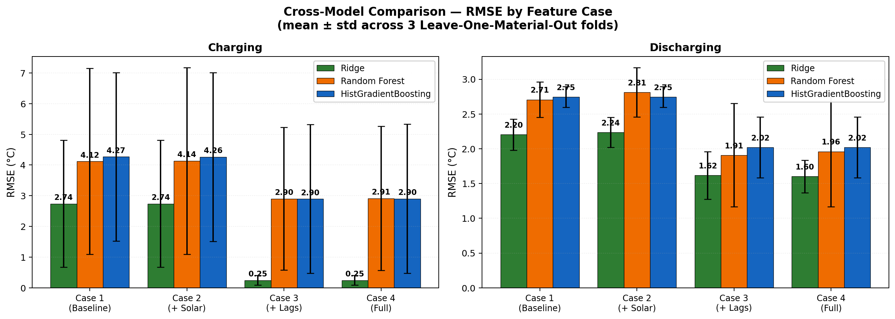
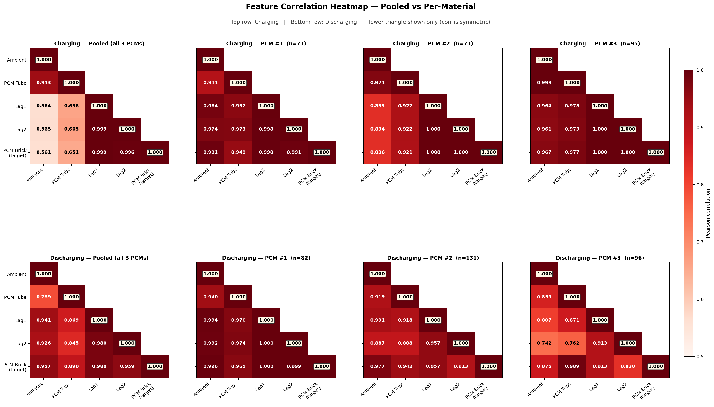

# PCM Thermal Forecasting

One-step-ahead temperature prediction for a Phase-Change Material (PCM) brick compartment.
Three models (Ridge, Random Forest, HistGradientBoosting) are compared across four feature
configurations under Leave-One-PCM-Out cross-validation.

## Setup

```bash
bash setup.sh
```

This creates a local `.venv/` and installs `pandas`, `scikit-learn`, `matplotlib`, `openpyxl`, `pyarrow`.

## Run

```bash
.venv/bin/python shared/prepare_data.py                    # raw xlsx -> data_clean/*.parquet
.venv/bin/python experiments/01_ridge/tune.py              # ~5 s
.venv/bin/python experiments/02_random_forest/tune.py      # ~1 min
.venv/bin/python experiments/03_gradient_boosting/tune.py  # ~10-15 min
```

Each `tune.py` runs the full grid search inside LOPO CV and writes its own
`metrics.csv`, `best_params.csv`, `grid_search_log.csv`, `predictions.csv`, and 7 PNG plots.

## Folder layout

```
PCM-Thermal-Forecasting/
├── Charging_Dataset.xlsx
├── Discharging_Dataset.xlsx
├── requirements.txt
├── setup.sh
├── data_clean/        regenerated parquet files
├── shared/            prepare_data.py, experiment.py, plots.py
├── experiments/
│   ├── 01_ridge/
│   ├── 02_random_forest/
│   └── 03_gradient_boosting/
├── figures/           consolidated plots (incl. comparison_rmse.png, feature_correlation.png)
├── all_metrics.csv    aggregated 72-row results table
├── all_best_params.csv
└── summary.csv
```

## Results

### Comparison RMSE



### Feature Correlation



### Best Model Results

| Regime | Case | Best Model | RMSE | MAE | R² | MAPE (%) |
|--------|------|-----------|------|-----|-----|----------|
| Charging | case1_baseline | Ridge | 0.12 | 0.10 | 0.999 | 0.31 |
| Charging | case2_solar | Ridge | 0.12 | 0.10 | 0.999 | 0.31 |
| Charging | case3_lags | Ridge | 0.12 | 0.10 | 0.999 | 0.31 |
| Charging | case4_solar_and_lags | Ridge | 0.12 | 0.10 | 0.999 | 0.31 |
| Discharging | case1_baseline | Ridge | 2.05 | 1.88 | 0.887 | 6.25 |
| Discharging | case2_solar | Ridge | 2.08 | 1.89 | 0.883 | 6.29 |
| Discharging | case3_lags | Ridge | 1.23 | 0.82 | 0.959 | 2.67 |
| Discharging | case4_solar_and_lags | Ridge | 1.46 | 1.35 | 0.958 | 3.47 |
